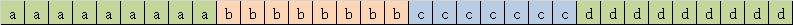
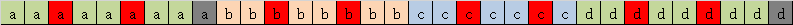
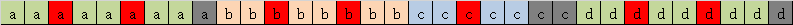
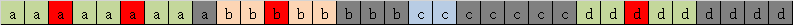

## 题目

如果一个密码满足下述所有条件，则认为这个密码是强密码：

- 由至少 `6` 个，至多 `20` 个字符组成。
- 至少包含 一个小写 字母，一个大写 字母，和 一个数字 。
- 同一字符 不能 连续出现三次 (比如 `"...aaa..."` 是不允许的, 但是 `"...aa...a..."` 如果满足其他条件也可以算是强密码)。

给你一个字符串 `password` ，返回 *将 `password` 修改到满足强密码条件需要的最少修改步数。如果 `password` 已经是强密码，则返回 `0`* 。

在一步修改操作中，你可以：

- 插入一个字符到 `password` ，
- 从 `password` 中删除一个字符，或
- 用另一个字符来替换 `password` 中的某个字符。

## 解题思路

- 下界是缺失的字符类型 N~c~ 。
- 如果长度 l 小于 6，那么通过添加 6 - l 个字符使密码合法，因为最长长度是 5。添加一个字符就可以打破连续的三个字符，所以不需要考虑连续，结果为 fmax(6 - l, N~c~)。
- 如果长度 l 小于等于 20，那么通过替换来去除连续，一个长度为 s 的连续串，需要 s / 3 次替换。（需要 (s - 2) / 2 次插入或 x - 2 次删除，所以不考虑）。替换次数为 N~m~，结果为 fmax(N~m~, N~c~)。
- 长度大于 20 必须要使用删除 l - 20 次，删除后还需要修改去除连续，结果为 fmax(N~m~, N~c~) + l - 20。
- 在删除的同时尽量消除连续以减少后续修改的数量。如果串中的连续串长度全部是 3n + 2 的形式，那么必须消除 3 个，才能减少一次修改，总共消除 N~r~ 次，结果为 fmax(N~m~ - N~r~ / 3, N~c~) + l - 20。
- 然而连续子串的长度还可以是 3n 与 3n + 1 的形式，我们发现对于 3n 形式的子串，只需要删除一个字符就能减少一次未来的修改，而连续子串的长度变为 3n + 2 的形式。而 3n + 1 形式的连续子串需要删除两个字符，从而减少一次未来的修改，并变为 3n + 2 的形式。
- 统计 3n 与 3n + 1 型子串的个数 N~0~ 与 N~1~，先转化 3n 型，如果能全转化，那么后续少修改 N~0~ 次，否则转化 N~r~ 个，未来少修改 N~r~ 次。然后转化 3n + 1 型，全转化还需要 2N~1~ 次删除，如果能全转化，那么后续少修改 N~1~ 次，否则转化 N~r~ / 2 个，未来少修改 N~r~ / 2 次。
- 全部转化为 3n + 2 型后，结果如之前所述。

接下来考虑一个用例：**aaaaaaaaabbbbbbbbcccccccddddddddd**

### 1. 首先分析字符串



- 缺失类型：2
- 超出长度：13
- 长度 3n 的重复串：2
- 长度 3n + 1 的重复串：1
- 长度 3n + 2 的重复串：1

### 2. 消除重复的串

先假设全部替换来消除


需要替换10个字符

### 3. 消除多余长度

然后考虑通过删除来消除多余的长度，删除的过程中第一步即将被替换的字符也被删除了，那么这些字符就不需要再执行替换了，需要减少替换的数量。

#### 首先删除长度为 3n 的重复串



长度 3n 的串每次删除一个字符，删除后就变成了 3n + 2 的串。

注意到，有两个即将被替换的字符串被删除了。

因此到这一步的结果：

- 替换：8
- 删除：2

#### 然后删除长度为 3n + 1 的重复串



长度为 3n + 1 的重复串每次删除两个，删除后变成了 3n + 2 的串。

注意到，有两个即将被替换的字符串被删除了。

因此到这一步的结果：

- 替换：7
- 删除：4

#### 处理剩下的需要删除的字符

剩下的字符串中只有 3n + 2 的重复串，多余 9 个字符串。

那么 3 个 3 个删除的，一定会有三个即将被替换的字符串被删除，因此这一步之后的结果是：



长度为 3n + 1 的重复串每次删除两个，删除后变成了 3n + 2 的串。

注意到，有两个即将被替换的字符串被删除了。

因此到这一步的结果：

- 替换：7 - 3 = 4
- 删除：4 + 9 = 13

### 4. 处理缺失的类型

整体字符串缺失数字和大写字母，缺失个数为 2，待替换的字符是 4，完全可以覆盖缺失个数，因此结果不变。

如果待替换的字符串是 1，缺失个数是 2，那么需要插入 1 个字符串，结果要 + 1。

这里本用例的结果为 13 + 4 = 17。

### 面向测试用例编程 （雾）

当然，如果想要双百的话，这道题也能 **面向测试用例编程**（切勿尝试，别怪我没提醒你 :）

```C
switch (password) {
    case "abababababababababaaa": return 3;
    case "aaaaaaaaaaaaaaaaaaaaa": return 7;
    case "ABABABABABABABABABABABAB": return 6;
    case "1010101010aaaB10101010": return 2;
    case "...": return 3;
    case "1234567890123456Baaaaa": return 3;
    case "aaa111": return 2;
    case "..................!!!": return 7;
    case "1Abababcaaaabababababa": return 2;
    case "aaaaabbbb1234567890ABA": return 3;
    case "aaaaaa1234567890123Ubefg": return 4;
    case "aaaaaaaAAAAAA6666bbbbaaaaaaABBC": return 13;
    case "": return 6;
    case "a": return 5;
    case "A": return 5;
    case "1": return 5;
    case "aA1": return 3;
    case "aA123": return 1;
    case "aa123": return 1;
    case "aaa123": return 1;
    case "1111111111": return 3;
    case "ABABABABABABABABABAB1": return 2;
    case "hoAISJDBVWD09232UHJEPODKNLADU1": return 10;
    case "ABABABABABABABABABABAB3b": return 4;
    case "ababababababababababaaa": return 5;
    case "abAbababababababaaa": return 1;
    case "abAbabababababababaaa": return 2;
    case "aaaaaa": return 2;
    case "A1234567890aaabbbbccccc": return 4;
    case "FFFFFFFFFFFFFFF11111111111111111111AAA": return 23;
    case "QQQQQ": return 2;
    case "aaaabbbbccccddeeddeeddeedd": return 8;
    case "ppppppppppppppppppp": return 6;
    case "ababababababababaaaaa": return 3;
    case "qqq123qqq": return 2;
    case "000aA": return 1;
    case "1020304050607080Baaaaa": return 3;
    case "10203040aaaaa50607080B": return 3;
    case "pppppp1020304050607080": return 3;
    case "ppppppppp": return 3;
    case "aaaabbaaabbaaa123456A": return 3;
    case "AAAAAABBBBBB123456789a": return 4;
    case "aaaabaaaaaa123456789F": return 3;
    case "1234567890123456Baaaa": return 2;
    case "aaaB1": return 1;
    case "ssSsss": return 1;
    case "aaaaAAAAAA000000123456": return 5;
    case "bbaaaaaaaaaaaaaaacccccc": return 8;
    default: return 0;
}
```

## 题解

### C

```C
int strongPasswordChecker(char * password) {

    bool has_digit = false, has_lower = false, has_upper = false;
    int  len = 0;
    char c;

    int cnt_mod[3] = {0, 0, 0}; /* 统计 3n, 3n + 1, 3n + 2 型连续子串的数量 */
    int n_modify = 0; /* 修改次数 */

    while (c = password[len]) {
        /* 统计字符类型 */
        switch (c) {
            case '0' ... '9':
                has_digit = true;
                break;
            case 'a' ... 'z':
                has_lower = true;
                break;
            case 'A' ... 'Z':
                has_upper = true;
                break;
        }

        /* 连续子串长度 */
        int i = len;
        while (password[++i] == c);
        int l = i - len;

        if (l >= 3) {
            n_modify += l / 3; /* 后续修改数等于重复长度 / 3 */
            cnt_mod[l % 3]++;
        }

        len = i;

    }

    /* 缺少的字符类型数目, 下界 */
    int n_missing_ctype = !has_digit+ !has_upper+ !has_lower;

    /* 过短，插入缺少的字符数量 */
    if (len < 6) {
        return fmax(6-len, n_missing_ctype);
    }

    /* 长度合法，修改去除连续子串 */
    if (len <= 20) {
        return fmax(n_modify, n_missing_ctype);
    }

    /* 过长，还可以删除 len - 20 个字符 */
    int n_remove = len - 20;
    
    /* 3n 型子串无法完全变为 3n + 2 型，
        每个需要 1 次删除，
        只能把 n_remove 个变为 3n + 2 型
        减少 n_remove 次后续修改
        */
    if (n_remove < cnt_mod[0]) {
        return fmax(n_modify - n_remove, n_missing_ctype) + len - 20;
    }

    /* 3n 型全部变为 3n+2 型 */
    n_remove -= cnt_mod[0];
    n_modify -= cnt_mod[0];

    /* 3n+1 型无法完全变为 3n + 2 型， 
        每个需要 2 次删除， 
        减少 n_remove / 2 次后续修改
        */
    if (n_remove < cnt_mod[1] * 2) {
        return fmax(n_modify - n_remove / 2, n_missing_ctype) + len - 20;
    }
    
    n_remove -= cnt_mod[1] * 2;
    n_modify -= cnt_mod[1];

    return fmax(n_modify - n_remove / 3, n_missing_ctype) + len - 20;
}
```

### Java

```Java
class Solution {
    public int strongPasswordChecker(String password) {
        //统计字符类型的缺失个数
        int[] missType = {1, 1, 1};
        //统计三种连续型子串的数量：长度模 3 为 0，1，2
        int[] mod3Cnt = new int[3];
        //统计修改次数
        int modifyCnt = 0;

        int len = password.length();

        for (int i = 0; i < len; ) {
            //统计字符类型
            char c = password.charAt(i);
            if (Character.isDigit(c)) {
                missType[0] = 0;
            } else if (Character.isLowerCase(c)) {
                missType[1] = 0;
            } else if (Character.isUpperCase(c)) {
                missType[2] = 0;
            }
            
            //统计连续子串（字符连续出现 3 次及以上）
            int iStart = i++;
            while (i < len && password.charAt(i) == c){
                i++;
            }
            int subLen = i - iStart;
            if (subLen >= 3) {
                //每3个替换1个，可保证不连续
                modifyCnt += subLen / 3;
                mod3Cnt[subLen % 3]++;
            }
        }

        int missTypeCnt = missType[0] + missType[1] + missType[2];

        //字符串长度限制为 [6，20]

        //1. 长度过短，仅考虑字符长度缺失和字符类型缺失
        if (len < 6) {
            return Math.max(6 - len, missTypeCnt);
        }
        //2. 长度合法，仅考虑连续字符串和字符类型缺失
        if (len <= 20) {
            return Math.max(modifyCnt, missTypeCnt);
        }
        //3. 长度过长，考虑删除过长的长度、连续字符串、字符类型缺失
        int deleteCnt = len - 20;

        //3n型子串，部分能通过删除转化成 3n + 2 型子串，每个子串删 1
        if (deleteCnt < mod3Cnt[0]) {
            return Math.max(modifyCnt - deleteCnt, missTypeCnt) + len - 20;
        }
        //3n 型子串，全部都能通过删除转化成 3n + 2 型子串
        deleteCnt -= mod3Cnt[0];
        modifyCnt -= mod3Cnt[0];

        //3n + 1 型子串，部分能通过删除转化成 3n + 2 型子串，每个子串删 2
        if (deleteCnt < mod3Cnt[1] * 2) {
            return Math.max(modifyCnt - deleteCnt / 2, missTypeCnt) + len - 20;
        }
        //3n + 1 型子串，全部都能通过删除转化成 3n + 2 型子串
        deleteCnt -= mod3Cnt[1] * 2;
        modifyCnt -= mod3Cnt[1];

        //3n + 2 型子串
        // (1) 删除 len - 20 个字符，使字符串长度降到合法长度
        // (2) 根据合法长度的公式，应为 Math.max(modifyCnt, missTypeCnt);
        // (3) 由于删除时可以删除连续子串中的字符，减少 modifyCnt
        //    aaa aaa aa  原需替换 2 次
        //    aaa aaa a   删除 1 次，仍需替换 2 次
        //    aaa aaa     删除 2 次，仍需替换 2 次
        //    aaa aa      删除 3 次，仍需替换 1 次
        // 即对于 3n + 2 型子串，删除 3 次可抵消替换 1 次
        //其他型的子串可以转换成 3n + 2 型
        return Math.max(modifyCnt - deleteCnt / 3, missTypeCnt) + len - 20;
    }
}
```

### Python

```Python
class Solution:
    def strongPasswordChecker(self, password: str) -> int:
        need_lower = need_upper = need_digit = True
        replace_count = 0
        repeat_counts = [0, 0, 0]  # 3n, 3n + 1, 3n + 2
        n, i = len(password), 0

        while i < n:
            c = password[i]
            if c.islower():
                need_lower = False
            elif c.isupper():
                need_upper = False
            elif c.isdigit():
                need_digit = False

            start = i
            while i < n and password[i] == c:
                i += 1
            size = i - start
            if size >= 3:
                repeat_counts[size % 3] += 1
                replace_count += size // 3

        need_types = need_lower + need_upper + need_digit

        if n < 6:
            return max(6 - n, need_types)

        if n <= 20:
            return max(replace_count, need_types)

        delete_count = n - 20

        if delete_count <= repeat_counts[0]:
            return max(replace_count - delete_count, need_types) + n - 20

        delete_count -= repeat_counts[0]
        replace_count -= repeat_counts[0]

        if delete_count <= repeat_counts[1] * 2:
            return max(replace_count - delete_count // 2, need_types) + n - 20

        delete_count -= repeat_counts[1] * 2
        replace_count -= repeat_counts[1]

        return max(replace_count - delete_count // 3, need_types) + n - 20
```

## 复杂度分析

- 时间复杂度：$O(n)$
- 空间复杂度：$O(1)$
