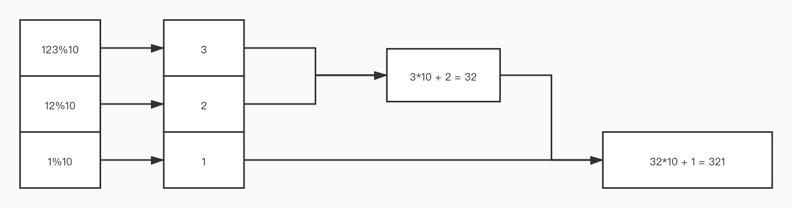

## 题目

给你一个整数 `x` ，如果 `x` 是一个回文整数，返回 `true` ；否则，返回 `false` 。

回文数是指正序（从左向右）和倒序（从右向左）读都是一样的整数。

例如，`121` 是回文，而 `123` 不是。

## 解题思路

本题可以作为编程入门练习题和学习 LeetCode 使用方式的题目。

简单来说，因为存在负号，负数不可能为回文数，`0` 为最小的回文数，所有的回文数减去反转后的数（倒序排列）都为零。

**例如：**`12345` 不是回文数，它反转后的数为 `54321`；`12321` 是回文数，它反转后的数仍然为 `12321`。

对于反转数有几种方法，一是直接调用系统预置函数，二是将数字转换为 **字符串** 后逐位反转，三是直接通过 **余数** 反转，前两种很好理解，第三种可以参考以下逻辑图：



## 题解

### PHP

`strrev()` 函数就是将数据倒序排列

```PHP
class Solution
{
    /**
     * @param Integer $x
     * @return Boolean
     */
    function isPalindrome($x) {
        if ($x < 0 || $x - strrev($x) != 0) {
            return false;
        }
        return true;
    }
}
```

### Python

```Python
class Solution:
    def isPalindrome(self, x: int) -> bool:
        x = str(x)
        if x == x[::-1]: #倒置
            return True
        else:
            return False
```

### C

```C
bool isPalindrome(int x) {
    if (x == 0) return true;
    if (x < 0) return false;
    long t = x, ret = 0; //防止 x 倒置后的 ret 溢出，故采用 long 类型，也可以用 unsigned int
    while (t) {
        ret = ret * 10 + t % 10;
        t /= 10;
    } //倒置
    return ret == x; //优美的返回值
}
```

### C++

```C++
class Solution {
public:
    bool isPalindrome(int x) {
        if (x < 0) return false;
        string s = to_string(x);
        return s == string(s.rbegin(), s.rend());
    }
};
```

### C#

```C#
public class Solution {
    public bool IsPalindrome(int x) {
        if (x < 0 || (x % 10 == 0 && x != 0)) {
            return false;
        }

        int revertedNumber = 0;
        while (x > revertedNumber) {
            revertedNumber = revertedNumber * 10 + x % 10;
            x /= 10;
        }

        return x == revertedNumber || x == revertedNumber / 10;
    }
}
```

### Java

```Java
class Solution {
    public boolean isPalindrome(int x) {
        if (x < 0) {
            return false;
        }
        int n = x;
        int m = 0;
        while(x != 0) {
            m = m * 10 + x % 10;
            x = x / 10;
        } //倒置
        return m == n;
    }
}
```

### Go

```Go
func isPalindrome(x int) bool {
	if x < 0 {
		return false
	}
	origin := x
	redirect := 0
	for x != 0 {
		redirect = redirect * 10 + x % 10
		x /= 10
	}
	return origin == redirect
}
```

### TypeScript

调用库直接一行，和 C# 逻辑基本一致

```TypeScript
function isPalindrome(x: number): boolean {
    let result: boolean = x == Number(x.toString().split('').reverse().join(''));
    return result;
};
```

### Kotlin

```Kotlin
class Solution {
    fun isPalindrome(x: Int): Boolean {
        if (x < 0) return false
        var x_ = x
        var n = 0

        while (x_ != 0) {
            n = n * 10 + x_ % 10
            x_ /= 10
        }

        return n == x
    }
}
```

### JavaScript

TypeScript 和 JavaScript 相比，还是 TypeScript 舒服点，果然是 **下一代编程语言** 呢

```JavaScript
/**
 * @param {number} x
 * @return {boolean}
 */
var isPalindrome = function(x) {
    if (x < 0) {
        return false
    } else {
        var x2 = parseInt(x.toString().split("").reverse().join(""))
        return x2 === x ? true : false
    }
};
```

### Ruby

虽然都是调用库，但是总觉得 Ruby 的代码不够优雅

```Ruby
# @param {Integer} x
# @return {Boolean}
def is_palindrome(x)
  return false if x < 0
  return true if x.to_s.reverse.to_i == x
  return false
end
```

### Rust

感谢 Rust，调用库一行解决 //似乎 Python 用库也行

```Rust
impl Solution {
    pub fn is_palindrome(x: i32) -> bool {
        return x.to_string().chars().rev().collect::<String>() == x.to_string()
    }
}
```

### Swift

字符串反转：

```Swift
class Solution {
    func isPalindrome(_ x: Int) -> Bool {
        var isBool = false
        if x < 0 {
            return isBool
        }else {
            let xStr = String(x)
            let xStr1 = String(xStr.reversed())
            if xStr == xStr1 {
                isBool = true
            }
        }
        return isBool
    }
}
```

余数反转：

```Swift
class Solution {
    func isPalindrome(_ x: Int) -> Bool {
        var isBool = false
        if x < 0 {
            return isBool
        }else {
            var xCopy = x
            var remainder = 0
            var num = 0
            while xCopy != 0 {
                remainder = xCopy % 10
                xCopy = xCopy / 10
                num = num * 10 + remainder
            }
            
            if num == x {
                isBool = true
            }
        }
        return isBool
    }
}
```

### Scala

```Scala
object Solution {
    def isPalindrome(x: Int): Boolean = {
        val t = x.toString
        return t == t.reverse
    }
}
```
